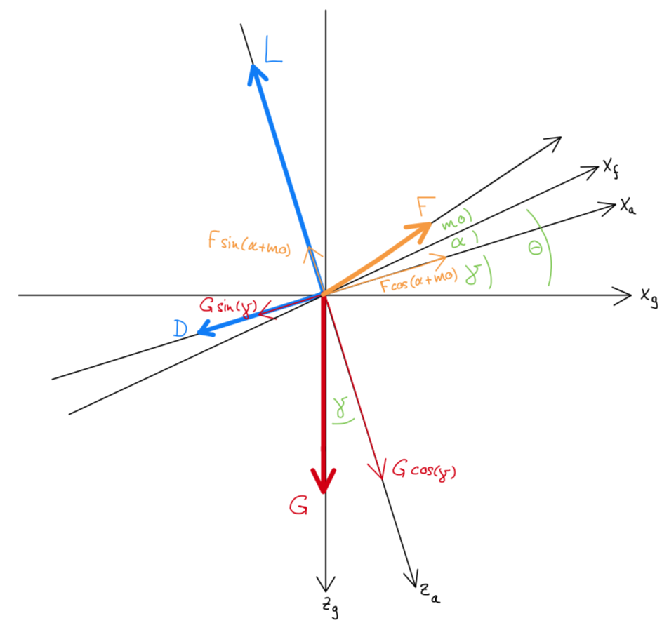

# AircraftTrim
**Trims the Elevator Deflection and Thrust for an User-Specified Aircraft and Flight-State.**

# Prerequisites
* Python 3.8.3 or later
* Numpy 1.18.5 or later

# Usage

### 1. Copy the File "AircraftTrim.py" to your Python working-directory 

### 2. Create a new python file

### 3. Add the following to the top of your code and replace the 0s with your data:
```python
import AircraftTrim

derLon = np.array([[0, 0, 0],
                   [0, 0, 0],
                   [0, 0, 0]])
```
where each element represents a longitudinal aerodynamic derivative:

CD0 (zero drag coefficient) | CDal (drag due to AoA)  | CDet (drag due to elevator deflection)
------------ | ------------- | -------------
**CL0 (zero lift coefficient)** | **CLal (lift due to AoA)**  | **CDet (lift due to elevator deflection)**
**Cm0 (zero pitching moment coefficient)** | **Cmal (pitching moment due to AoA)**  | **Cmet (pitching moment due to elevator deflection)**

further add
```python
aircraft = {"Mass": 0,
        "Mean Wing Chord": 0,
        "Reference Wing Area": 0,
        "Thrust Vector Mounting Angle": 0,
        "Leverage Arm of the Thrust Vector": 0,
        "Maximum Total Thrust": 0,
        "Longitudinal Derivatives": derLon
        }
VA = 0 
rh = 0  # 1.225 at MSL
ga = 0
```
where
* VA is the true air speed (in m/s)
* rh is the air density (in kg/m^3)
* ga is the flight path angle (in RADIANTS)

### 4. call the function inside your newly created file:
```python
solution = AircraftTrim.trim(aircraft, VA, rh, ga, g=9.80665, X0=np.array([0, 0, 1000]), tol=1e-8, it=16, verbose='last')
```

### 5. *Optionally * the following inputs can be changed:
* g: gravitational constant (may vary slightly with lattitude and altitude) (in m/s^2)
* X0: initial guess for the solver
* tol: tolerance of the error in between the last two iterations
* it: maximum number of iterations
* verbose: can be "all" or "last", any other input will prevent an console-output
### 6. The results are stored to the variable *"solution"*. The variable will be a 1D-numpy array contaning four elements:
* Angle of Attack (in RADIANTS)
* Elevator Deflection (in RADIANTS)
* Total Thrust (in NEWTON)
* Efficiency Indicator = VA / F (in s/kg)

# Explanation
* In straight, unaccelerated flight (no rolling angle), the aircraft either ascends, descends or stays level. As there is no sideways motion, the aircraft can be inspected from the side and a 2D-representation of external Forces drawn as shown below. The thin colored vectors represent the same force as their corresponding thick vectors, they are just expressed in the aerodynamic coordinate system. 

* As the sum of all forces and moments must be zero for unaccelerated flight, three equilibrium equations can be stated. (see File [AircraftTrim.py](AircraftTrim.py) line 87 to 89)
* Next, the Jacobian Matrix can be fomulated for the abovementioned three equations and the variables:
    * Angle of Attack (alpha)
    * elevator decflection (eta)
    * Thrust (F)
* Finally, the Trim algorith utilizes the multi-dimensional version of Newton's Method described in
[Courtney Remani - "Numerical Methods for Solving Systems of Nonlinear Equations"](https://www.lakeheadu.ca/sites/default/files/uploads/77/docs/RemaniFinal.pdf) from Page 7 onwards.
